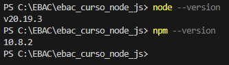

# EBAC - Curso Node.js - Módulo 01

**🔗 Repositório GitHub:** https://github.com/JonathanBoza/ebac_curso_node_js

## Exercício: Executando o ambiente

### Objetivo
Preparar o ferramental para desenvolvimento com Node.js

### Requisitos do Exercício
1. ✅ Instalar o Node.js no computador
2. ✅ Instalar o VS Code no computador e a extensão ESLint
3. ✅ Executar o comando no terminal do VS Code: `node --version`
4. ✅ Enviar o print screen do resultado do comando

### Resultados

#### Versão do Node.js instalada:
```bash
node --version
v20.19.3
```

#### Versão do npm instalada:
```bash
npm --version
10.8.2
```

#### Extensão ESLint
- ✅ Extensão ESLint está instalada no VS Code
- ID: `dbaeumer.vscode-eslint`
- Descrição: Integrates ESLint JavaScript into VS Code

### 📸 Print Screen para Entregar
O resultado do comando mostrado no terminal foi:
```
PS C:\EBAC\ebac_curso_node_js> node --version
v20.19.3
```



### 📋 Para Entregar
1. ✅ Print screen da tela do terminal: `print.png`
2. ✅ Arquivo `README.md` com toda a documentação do exercício

### Conclusão
✅ Ambiente Node.js configurado com sucesso!
✅ VS Code configurado com extensão ESLint
✅ Comandos executados com sucesso

### Próximos passos
O ambiente está pronto para começar a desenvolver aplicações Node.js!

---

## 📂 Informações do Repositório
- **GitHub:** https://github.com/JonathanBoza/ebac_curso_node_js
- **Autor:** JonathanBoza
- **Curso:** EBAC - Node.js
- **Módulo:** 01 - Preparando o ferramental
