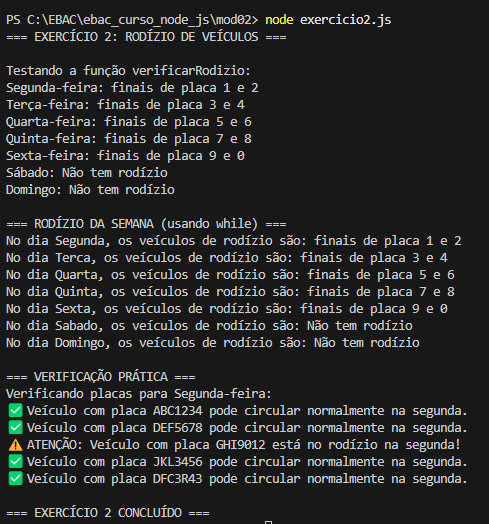
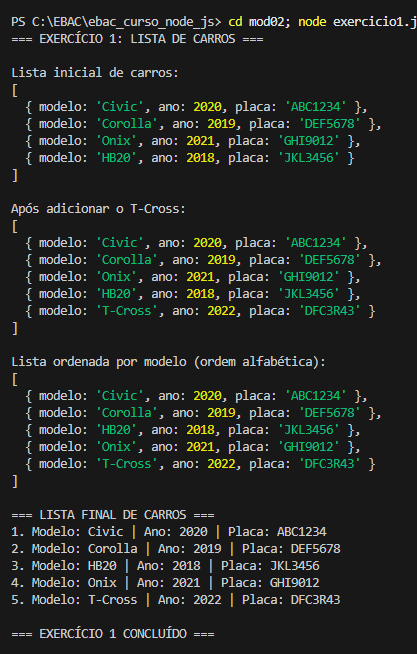

# EBAC - Curso Node.js - Módulo 02

**🔗 Repositório GitHub:** https://github.com/JonathanBoza/ebac_curso_node_js/tree/main/mod02

## Exercício: Meus primeiros programas

### Objetivo
Introdução à linguagem JavaScript com Node.js

### Conteúdo do Módulo
- Como executar scripts NodeJS
- O básico da linguagem de programação
- O que são estruturas de dados e como manipular listas e dicionários
- O que são laços, funções e iteradores
- Como importar e exportar módulos entre arquivos node

### Exercícios Realizados

## 📝 Exercício 1: Lista de Dicionários de Carros

### Requisitos:
1. ✅ Criar uma lista de dicionários que contenha pelo menos 4 carros
2. ✅ Cada item da lista deve ser um dicionário representando um carro com informações: placa, modelo e ano
3. ✅ Utilizando manipulações de lista (push) adicione o seguinte dicionário à sua lista de carros:
   ```javascript
   {
       modelo: "T-Cross",
       ano: 2022,
       placa: "DFC3R43"
   }
   ```
4. ✅ Ordene a sua lista de carros pelo nome do modelo em ordem alfabética

### Como executar:
```bash
npm run ex1
# ou
node exercicio1.js
```

### 📸 Print Screen - Exercício 1:


## 📝 Exercício 2: Função de Rodízio de Veículos

### Requisitos:
1. ✅ Fazer uma função que receba como parâmetro o dia da semana e retorne a lista de veículos que possuem rodízio naquele dia
2. ✅ Fazer um laço (while) que imprima a mensagem na tela sobre o rodízio

### Regras do Rodízio:
- **Segunda-feira:** finais de placa 1 e 2
- **Terça-feira:** finais de placa 3 e 4
- **Quarta-feira:** finais de placa 5 e 6
- **Quinta-feira:** finais de placa 7 e 8
- **Sexta-feira:** finais de placa 9 e 0
- **Sábado e Domingo:** Não tem rodízio

### Como executar:
```bash
npm run ex2
# ou
node exercicio2.js
```

### 📸 Print Screen - Exercício 2:


### Executar ambos exercícios:
```bash
npm start
```

## 🎯 Resultados

### Exercício 1 - Lista de Carros:
- Lista inicial com 4 carros
- Adição do T-Cross usando `push()`
- Ordenação alfabética por modelo usando `sort()`

### Exercício 2 - Rodízio de Veículos:
- Função `verificarRodizio()` que retorna as placas do rodízio por dia
- Laço `while` que percorre todos os dias da semana
- Função adicional `verificarVeiculoRodizio()` para verificar placas específicas

## 📸 Print Screens dos Exercícios

### Exercício 1 - Lista de Carros:


### Exercício 2 - Rodízio de Veículos:


## 📋 Arquivos do Projeto
- `exercicio1.js` - Lista de dicionários de carros
- `exercicio2.js` - Função de rodízio de veículos
- `package.json` - Configuração do projeto
- `README.md` - Documentação
- `prin1.png` - Print screen do exercício 1
- `prin2.png` - Print screen do exercício 2

## 🚀 Como Executar o Projeto

1. **Navegar para o diretório:**
   ```bash
   cd mod02
   ```

2. **Executar exercício 1:**
   ```bash
   node exercicio1.js
   ```

3. **Executar exercício 2:**
   ```bash
   node exercicio2.js
   ```

4. **Executar ambos:**
   ```bash
   npm start
   ```

### Conclusão
✅ Exercícios de manipulação de listas e dicionários concluídos
✅ Funções e laços implementados corretamente
✅ Estruturas de dados JavaScript dominadas

---

## 📂 Informações do Repositório
- **GitHub:** https://github.com/JonathanBoza/ebac_curso_node_js/tree/main/mod02
- **Pasta:** mod02
- **Autor:** JonathanBoza
- **Curso:** EBAC - Node.js
- **Módulo:** 02 - Introdução à linguagem
